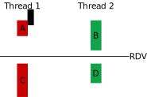
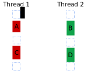

---
title: 26 - POSIX Threads III
author: Igor Montagner
...

# Parte 0 - paralelismo e semáforos

Na última aula trabalhamos com *Mutex*, um mecanismo de sincronização usado para criar regiões de exclusão mútua que somente uma thread pode rodar por vez. Neste aula trabalharemos com semáforos, um mecanismo de sincronização mais sofisticado e geral usado para que threads sincronizem seu progresso e possam executar **em paralelo**.

**Definição**: duas tarefas podem ser feitas em paralelo se

1. elas não compartilham absolutamente nenhuma informação.
1. elas compartilham informação mas possuem **mecanismos de sincronização** de tal maneira que **toda ordem de execução possível** de suas instruções resulte no mesmo resultado final. 

# Parte 1 - Rendez-vous

A expressão *Rendez-vous* significa, literalmente, *encontro* em francês. Ela é usada para marcar um horário para duas ou mais pessoas se encontrarem. No contexto de sincronização de tarefas, ele também é usado para nomear o problema de sincronização mais simples: duas threads rodando funções distintas precisam se sincronizar no meio de suas funções. 

{width=400px}

As partes A e B podem ser feitas em qualquer ordem, mas ambas obrigatoriamente devem ocorrer antes de iniciar a execução de C e D. Note que C e D também podem ser feitas em qualquer ordem. 

 Quando dizemos que duas tarefas podem ser feitas em qualquer ordem não quer dizer que elas possam ser feitas em paralelo! Apenas estamos dizendo que A inteira pode ocorrer antes ou depois de B inteira e os resultados serão os mesmos.  

\newpage

**Exercício**: Marque abaixo as ordens de execução possíveis para as partes A, B, C e D.

1. A C B D
1. A B C D
1. B D A C
1. B A D C
1. B A C D 

Vamos fazer a solução do RDV no papel primeiro. 

**Inicialização**: Preencha aqui quantos semáforos serão usados, seus nomes e valores iniciais. \vspace{3em}

**Sua solução**: Indique abaixo em quais quadrados azuis você usaria seus semáforos para resolver o RDV. Você pode usar mais de um semáforo em um mesmo quadrado e pode deixar os outros vazios.

{width=600px}

\newpage

# Parte 2 - Barreira

Agora que já conseguimos fazer uma sincronização de duas threads, como faríamos para criar uma **barreira** que generaliza o RDV para *n* threads? Ou seja, uma thread esperando na barreira só pode prosseguir quando **todas as outras** alcançarem a barreira também. 

**Exercício**: Uma alternativa seria usar *n* semáforos. Escreva abaixo como isso seria organizado. Escreva abaixo o valor que cada semáforo começa e dê um exemplo de duas das *n* threads.\vspace{20em}

**Exercício**: A solução acima é boa? \vspace{5em}

**Exercício**: Uma segunda alternativa seria usar uma variável que conta o número de threads que já chegaram na barreira e transformar tudo em um semáforo só. Como seria essa solução? Não esqueça de checar se seu programa tem condições de corrida. \vspace{20em}

A solução anterior supõe que cada thread conhece o número de outras threads que foram lançadas. Apesar de isto não ser necessariamente ruim, podemos criar uma solução em que não usamos este conhecimento e em que cada thread não conhece o número de outras threads rodando. 

Essa solução envolve uma técnica chamada de **passagem de bastão**: uma thread dá a vez para outra thread rodar. No caso da barreira, a última thread pode desbloquear outra(s) que está(ão) esperando. 

\newpage

**Exercício**: Escreva abaixo uma solução com passagem de bastão.  \vspace{20em}

# Parte 3 - implementações

Vamos agora implementar o RDV e a barreira usando semáforos POSIX. A página `sem_overview` do manual contém um resumo do uso de semáforos. A partir de seu conteúdo responda as questões abaixo. 

**Exercício**: Quais os dois tipos de semáforos disponíveis em POSIX? Qual a utilidade de cada tipo? \vspace{10em}

**Exercício**: Qual o tipo de variável usada para guardar um semáforo? Quais funções são usadas para criar e destruir cada tipo de semáforo? \vspace{5em}

**Exercício**: Quais as funções usadas para incrementar e decrementar um semáforo? Elas podem ser usadas para ambos tipos de semáforo? \vspace{5em}

Vamos modificar nosso programa que computa a soma para computar agora a variância do vetor também. Percebem que agora temos duas partes que tem uma relação de dependência:

1. Computar a soma (divida em duas partes)
1. Computar a variância (que depende da soma)

**Exercício**: faça um programa que usa RDV para sincronizar duas threads no cálculo da variância. 

**Exercício**: faça um programa que usa uma **barreira** para sincronizar o cálculo da variância. 

