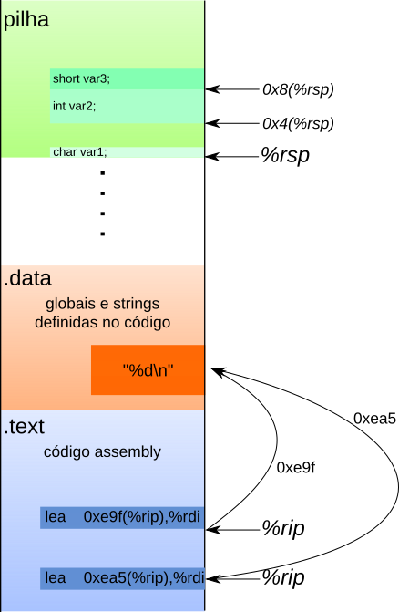

# 03 - Arquitetura x86-64

!!! pdf
    

No handout passado usamos o *gdb* para listar variáveis globais, nomes de funções e examinar endereços de memória. Neste handout vamos começar a usar o *gdb* também para examinar nossos programas *durante sua execução*.

## Parando e continuando a execução de um programa.

Compile *funcoes.c* usando as flags:

<div class="termy">

```console
$ gcc -Og -g -Wall -std=c99 funcoes.c -o funcoes
```
<br>

</div>

!!! tip
    Na compilação, `-Og` irá permitir otimizações de código que não interfiram no debugging. Já o parâmetro `-g` irá tornar disponíveis informações úteis para o debugging (como tipos de variáveis e cabeçalhos das funções)

!!! exercise text long
    Abra o executável com o *gdb* e liste suas funções e suas variáveis globais. **Não rode o programa ainda!** Anote abaixo seus endereços e nomes.

    !!! answer
        
        ```asm

        (gdb) info functions
        All defined functions:

        File funcoes.c:
        10:     int funcao1(int, int *);
        5:      int funcao2(int);
        18:     int main(int, char **);
        
        (gdb) info variables 
        All defined variables:

        File funcoes.c:
        3:      int times_called;
        ```

!!! exercise text long
    O comando `disas` é usado para mostrar as instruções de máquina de uma função. Use-o para ver o código de máquina da função `funcao1`. Liste abaixo quais registradores foram usados nesta função e qual o tamanho dos dados guardados neles.

    !!! answer
        ```asm

        (gdb) disas funcao1 
        Dump of assembler code for function funcao1:
        0x000000000000117f <+0>:     endbr64 
        0x0000000000001183 <+4>:     mov    %edi,%eax
        0x0000000000001185 <+6>:     add    (%rsi),%eax
        0x0000000000001187 <+8>:     ret    
        End of assembler dump.
        ```

        Os registradores `%edi`, `%eax` armazenam valores de 4 bytes e o registrado `%rsi` armazena um endereço de 8 bytes.

!!! exercise text long
    Com base nos tamanhos identificados, você consegue associar os registradores acima com as variáveis no código de `funcao1`?
    
    !!! answer
        O registrador `%edi` armazena o valor da variável `int a` e o registrador `%rsi` representa o argumento  `int *b`, e por fim, o retorno da função, variável `int c`, é armazenado na variável `%eax`.

!!! exercise text short
    Use o comando `break funcao1` para parar a execução do programa quando a função `funcao1` começar a executar. Execute o programa usando `run`. O quê ocorre?
    
    !!! answer
        A execução do programa para exatamente na entrada da função `int funcao1(int a, int *b)`. 
        ```asm
        (gdb) run
        Starting program: /home/luba/00-Aulas/03-arquitetura-x86/funcoes 
        [Thread debugging using libthread_db enabled]
        Using host libthread_db library "/lib/x86_64-linux-gnu/libthread_db.so.1".

        Breakpoint 1, funcao1 (a=a@entry=10, b=b@entry=0x7fffffffdc80) at funcoes.c:10
        10      int funcao1(int a, int *b) {
        ```    

Após executar o `run`, utilize `disas funcao1` e observe no código da função uma seta indicando o próximo comando a ser executado, que representa o breakpoint no início da função.

!!! tip
    Os comandos `info breakpoints`, `info b` ou ainda `i b` podem ser utilizados para listar os breakpoints inseridos no código!

!!! exercise text long
    Podemos usar o comando `info registers edi` para ver o conteúdo atual do registrador `%edi`. Qual é este valor? Verifique quais argumentos são passados para `funcao1` no código *C* e, com estas informações em mãos, escreva abaixo suas novas conclusões.

    !!! answer
        O regitrador `%edi` tem o valor `10`, esse valor é passado no primeiro argumento da `função1`.

        ```asm
        (gdb) info registers edi
        edi            0xa                 10
        ```

!!! exercise text short
    O comando `stepi` executa exatamente uma instrução de máquina. Use-o uma vez e execute novamente `disas funcao1`. O que aconteceu? É possível saber em qual instrução o programa está parado?

    **Dicas**:

    1. se a primeira instrução for `endbr64`, execute `stepi` mais uma vez!
    1. use `disas` de novo
    2. verifique novamente o conteúdo de `%edi`

    !!! answer
        A instrução em que o programa está parado é apontada pela seta `=>`

        ```asm
        (gdb) stepi
        13          int c2 = b1 + c;
        (gdb) disas
        Dump of assembler code for function funcao1:
           0x000055555555517f <+0>:     endbr64 
        => 0x0000555555555183 <+4>:     mov    %edi,%eax
           0x0000555555555185 <+6>:     add    (%rsi),%eax
           0x0000555555555187 <+8>:     ret 
        ```

!!! exercise text short
    Cheque novamente o valor de `%edi`. Este valor condiz com a instrução executada? O que ela faz, exatamente?

    !!! answer
        A instrução `mov %edi,%eax` move o valor de `%edi` para `%eax`, em seguida, a instrução `add (%rsi),%eax` adiciona o conteúdo apontado pelo registrador `%rsi` ao registrador `%eax`, pois `%rsi` é um ponteiro.

!!! exercise text short
    Use `stepi` para parar logo antes do retorno da função. Verifique o conteúdo do registrador `%eax` e compare-o com os prints feitos pelo program. Você consegue dizer seu uso?

    !!! answer
        O registrador  `%eax` tem o valor `30` e usado para retornar o valor calculado na função.
        ```asm
        (gdb) info registers eax
        eax            0x1e                30
        ```

!!! exercise text 
    Vamos agora analisar o registrador `%rsi`. Toda vez que um registrador aparece entre `( )` estamos fazendo um acesso a memória. Ao mostrar seu conteúdo usando `info registers rsi` recebemos o endereço de memória que contém o dado que queremos acessar.

!!! exercise text 
    Use o comando `x` para mostrar, em decimal, o `int` que está armazenado no endereço descoberto no exercício anterior. Confira seu resultado com o código.

    Para lembrar como usar o comando `x` acesse esse link: https://sourceware.org/gdb/onlinedocs/gdb/Memory.html


!!! tip
    Execute o comando `continue` para continuar rodando o programa. Ele irá rodar até que o próximo *breakpoint* seja alcançado ou até que o programa termine.

## Endereçamento relativo e variáveis globais

Na parte anterior analisamos o código Assembly de nossa primeira função e vimos como

* mostrar o código fonte de uma função usando `disas`
* mostrar o conteúdo de um registrador usando `info registers`
* executar exatamente uma instrução usando `stepi`

Também vimos que ao colocar um registrador entre `( )` estamos fazendo um acesso a memória. Esta operação é equivalente a desreferenciar um ponteiro usando `*p`. Neste roteiro iremos adicionar um detalhe importante: podemos fazer contas com endereços usando esta notação. Nos exemplo abaixo nos referimos a memória como um grande vetor de bytes `unsigned char M[]`. Ou seja, ao acessar `M[%rax]`, por exemplo, estamos acessando o lugar na memória cujo endereço está escrito em `%rax`.

1. `10(%rax)`: acessa a memória `M[%rax + 10]`.
1. `(%rax, %rdi, 4)`: acessa a memória `M[%rax + 4 * % rdi]`. Note que isto se parece com aritmética de ponteiros cujo tipo apontado seja inteiro, pois os endereços pulam de 4 em 4 bytes.

!!! exercise
    Saia e abra o *gdb* novamente. Mostre o código de máquina da função `funcao2` e coloque um breakpoint em sua primeira instrução.

!!! exercise
    Execute agora o programa. A execução deve ter parado no início de `funcao2`. Rode `disas funcao2`.

!!! exercise text long
    Você consegue identificar acessos a memória em `funcao2`? Quais são de leitura e quais são de escrita? Qual o tamanho dos dados lidos/escritos?
    
    !!! answer
        A instrução `mov 0x2ea1(%rip),%eax` faz **leitura** do valor da variável global `times_called` representado pelo endereço `0x2ea1(%rip)`, a instrução `mov %eax,0x2e98(%rip)` faz a **escrita** do valor de `%eax` na variável global  `times_called`.


!!! exercise text short
    Qual o significado do registrador `%rip`? Se não se lembrar reveja os slides.

    !!! answer
        Registrador `%rip` (*Instruction Pointer Register*), às vezes também chamado de *Program Counter*, guarda o endereço da próxima instrução a ser executada pela CPU.

O tipo de acesso a memória que estamos realizando se chama `rip relative addressing`. Este tipo de acesso é reservado para variáveis globais e dados somente leitura. Estes dados tem uma característica especial: eles são copiados para a memória seguindo o mesmo layout do arquivo executável. Ou seja, as posições *relativas* entre o código e os dados globais são fixas.

!!! exercise text long
    Anote abaixo o endereço das funções `MOV` que utilizam este acesso. Baseado nos exemplos acima, descubra o endereço da variável acessada.
    
    !!! answer
        A variável acessa é a `times_called` e seu endereço é `0x555555558014`, veja abaixo:
        ```asm
        mov    0x2ea1(%rip),%eax        # 0x555555558014 <times_called>
        ```


??? details "Desenho de acesso a memória usando `%rip`"
    A figura abaixo ilustra como funciona o endereçamento usando o registrador `%rip`. Note que os deslocamentos são diferentes pois o endereço da instrução atual é diferente. Porém, o resultado final do endereço calculado em ambas instruções é o mesmo, indicando que ambas se referem ao mesmo local na memória.

    

!!! exercise
    Confira se o valor identificado na questão anterior é o mesmo mostrado a direita das instruções `MOV` na saída do `disas`. O *gdb* já calcula este endereço para facilitar nossa vida, mas é interessante calcular isto manualmente uma vez para entender melhor o processo.

!!! exercise text short
    Use o comando `continue` para continuar o programa. Você deve estar agora na segunda execução de `funcao2`. Use o comando `x` para mostrar o valor armazenado na memória calculada acima. Lendo o código do programa, você consegue dizer qual variável é armazenada neste endereço? O valor atual é o esperado para a segunda execução de `funcao2`?
    !!! answer
        
        ```asm
        (gdb) x 0x555555558014
        0x555555558014 <times_called>:  0x00000001
        ```

Além de poder mostrar valores na memória podemos **escrever** valores também. A sintaxe usada é a seguinte:

> `set *( (tipo *) 0x.....) = valor`

onde devemos substituir `tipo` por um tipo básico de *C*, `0x...` pelo endereço desejado e `valor` pelo valor que queremos escrever. Note que o que estamos fazendo é um *cast* do endereço `0x....` para um ponteiro de `tipo` e depois estamos acessando o valor apontado usando `*`!

!!! exercise text long
    Escreva o valor `-10` na memória da variável global usada em `funcao2`. Rode o programa até o fim. O resultado foi o esperado? Escreva abaixo os comandos utilizados.
    
    !!! answer
        
        ```asm
        (gdb) set *((int*)  0x555555558014)=-10
        (gdb) x 0x555555558014
        0x555555558014 <times_called>:  0xfffffff6
        ```

!!! bug "Desafio"
    Localize na função `main` as chamadas ao comando `printf`, analise as chamadas para responder o próximo exercício!

!!! exercise text long
    Encontre os endereço das strings de formatação do `printf` e use o comando `x` para mostrá-las no gdb. Escreva os comandos usados abaixo.
    
    !!! answer
        O endereço das strings da função `printf` estão nas instruções como  ` lea 0xe46(%rip),%rsi        # 0x2004` para mostrar o seu conteúdo use `x/s <endereço>`:
        ```asm
        (gdb) x/s 0x2004
        0x2004: "Resultado: %d\n"
        ```

## Atividade para entrega!

Aula com **atividade** para **entrega**. Confira seu repositório de entregas do classroom!

!!! warning "Atenção"
    Faça `git pull` no seu repositório de entregas que irá aparecer uma nova pasta dentro de `atv`.

!!! tip "Dica"
    Leia o `README.md` disponível **na pasta da atividade** para descobrir como resolver e entregar.