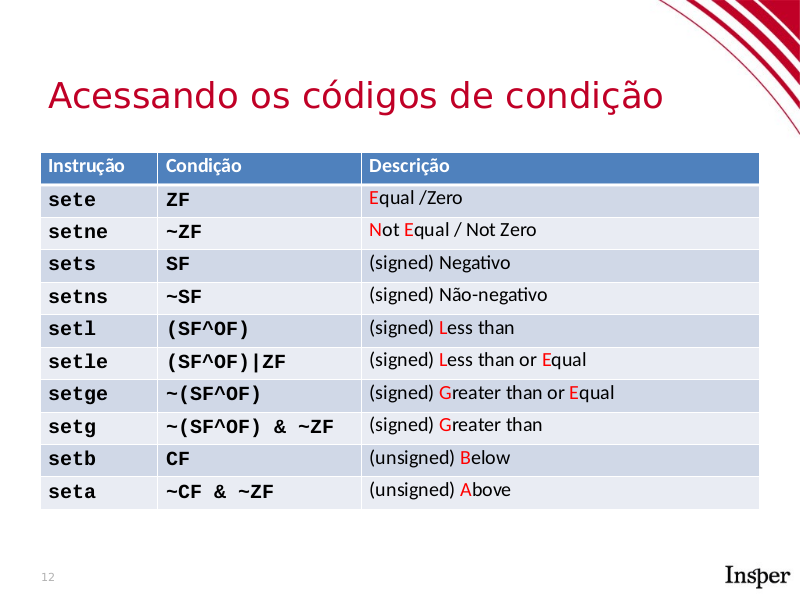

# 05 - Condicionais

## Expressões booleanas

Vimos na expositiva que toda operação aritmética preenche as flags `CF`, `ZF`, `SF` e `OF` e que podemos usar estas flags para montar expressões booleanas com as instruções `set*`. A tabela abaixo mostra as instruções responsáveis cada tipo de expressão booleana.



Também vimos que podemos preencher estas flags usando as instruções `cmp` e `test`, que executam operações aritméticas (subtração e E bit a bit) mas não guardam o resultado.

Vamos analisar o código assembly da seguinte função:

```c
int igual(int a, int b) {
    return a == b;
}
```

```asm
0000000000000000 <igual>:
0:   39 f7                   cmp    %esi,%edi
2:   0f 94 c0                sete   %al
5:   0f b6 c0                movzbl %al,%eax
8:   c3                      retq
```

A comparação `a == b` é feita primeiro executando `cmp` entre os argumentos `%edi` e `%esi` e depois usando `sete` (*set equal*) para atribuir 1 `%al` se `%edi == %esi` e 0 caso contrário.

Por fim, temos a instrução `movzbl`, que faz o cast de `char` (`%al`) para `int` (`%eax`). Lembre-se que as instruções `set*` só modificam os primeiros 8 bits de `%eax`. O restante continua com o valor antigo. Usamos `movzbl` para extender o número em `%al` para ocupar todo `%eax`.

!!! tip
    As instruções de conversão de tipos são bastante frequentes em Assembly, principalmente para expandir valores colocados em registradores menores para registradores maiores. Elas seguem a seguinte regra:

    `MOVtsd`

    * `t` pode ser `z` para tipos unsigned (completando com **z**eros) e `s` para tipos signed (completando com o bit de **s**inal).
    * `s` é o tamanho do registrador fonte seguindo a notação `b` para 1 byte, `w` para 2 bytes, `l` para 4 bytes e `q` para 8 bytes.
    * `d` é o tamanho do registrador destino, seguinto a mesma notação acima.

Por exemplo, a instrução `MOVZWQ` converte um `unsigned short` para um `unsigned long`. Conversões de 4 para 8 bytes muitas vezes são feitas com a instrução `cltq`, que extende (com sinal) `%eax` para `%rax`. Uma boa referência é este [site da Oracle](https://docs.oracle.com/cd/E19120-01/open.solaris/817-5477/eoizm/index.html).


Vamos agora praticar. Nos 3 exercícios abaixo temos funções que avaliam uma (ou mais) expressões booleanas entre seus argumentos e retornam o resultado.

### Arquivo `ex1`
Reconstrua a função `ex1` a partir do código assembly abaixo.

```asm
Dump of assembler code for function ex1:
   0x0000000000000000 <+0>:	cmp    $0xa,%edi
   0x0000000000000003 <+3>:	setg   %al
   0x0000000000000006 <+6>:	movzbl %al,%eax
   0x0000000000000009 <+9>:	retq
End of assembler dump.
```

!!! question short
    Qual é o tamanho do argumento de `ex1`? Ele é `signed` ou `unsigned`?

!!! example
    Coloque sua tradução abaixo. Valide sua solução com o professor ou com algum colega que já validou sua solução.

### Arquivo `ex2`

Reconstrua a função `ex2` a partir do código assembly abaixo

```asm
Dump of assembler code for function ex2:
   0x0000000000000000 <+0>:	cmp    %rsi,%rdi
   0x0000000000000003 <+3>:	setbe  %al
   0x0000000000000006 <+6>:	movzbl %al,%eax
   0x0000000000000009 <+9>:	retq
End of assembler dump.

```

!!! question short
    Qual é o tamanho dos argumentos de `ex2`? Ele é `signed` ou `unsigned`?

!!! example
    Coloque sua tradução abaixo. Valide sua solução com o professor ou com algum colega que já validou sua solução.

### Arquivo `ex3`

Reconstrua a função `ex3` a partir do código assembly abaixo.

```asm
Dump of assembler code for function ex3:
   0x0000000000000000 <+0>:	    cmp    %rsi,%rdi
   0x0000000000000003 <+3>:	    setg   %al
   0x0000000000000006 <+6>:	    test   %rsi,%rsi
   0x0000000000000009 <+9>:	    setg   %dl
   0x000000000000000c <+12>:	and    %edx,%eax
   0x000000000000000e <+14>:	movzbl %al,%eax
   0x0000000000000011 <+17>:	retq
End of assembler dump.

```

!!! question short
    Qual é o tamanho dos argumentos de `ex3`? Ele é `signed` ou `unsigned`?

!!! example
    Coloque sua tradução abaixo. Valide sua solução com o professor ou com algum colega.

## Condicionais

Vimos na segunda parte expositiva que Assembly possui apenas instruções de pulos condicionais (`j*` onde `*` representa uma comparação usando as mesmas abreviações de `set*`) e não condicionais (`jmp`). Vimos também que a combinação destas instruções com `cmp` e `test` é equivalente à dupla de comandos

```c
if (cond-booleana) {
    goto label;
}
```

A tabela abaixo mostra as operações de saltos condicionais.


### Exemplo guiado

Vamos agora fazer um exemplo guiado. Analisaremos o seguinte código:

```c
0000000000000000 <eh_par>:
0:   40 f6 c7 01             test   $0x1,%dil
4:   74 06                   je     c <eh_par+0xc>
6:   b8 00 00 00 00          mov    $0x0,%eax
b:   c3                      retq
c:   b8 01 00 00 00          mov    $0x1,%eax
11:  c3                      retq
```

Pares de instruções `test-j*` ou `cmp-j*` são comumente usadas para representar a construção `if-goto`.

!!! question short
    O nome da função dá uma dica de seu valor de retorno. Você consegue entender o porquê `test $1, %dil` faz isto?

    **Dica:** Escreva o teste exato que a função faz.

Vamos agora traduzir a função `eh_par` para **gotoC**. As linhas `0-4` são transformadas em um par `if-goto`. O restante são instruções que já conhecemos.

```c
int eh_par(long a) {
    if (a & 1 == 0) goto if1;

    return 0;

    if1:
    return 1;
}
```

Tiramos então o `goto` e levando em conta sua resposta no item anterior, ficamos com o seguinte código. Note que precisamos negar a comparação feita no código anterior!

```c
int eh_par(long a) {
    if (a % 2 != 0) {
        return 0;
    }
    return 1;
}
```

Podemos observar duas coisas no código assembly gerado:

1. O código que estava dentro do `if` foi colocado após o código que estava fora do if! O compilador pode mudar a ordem dos nossos blocos de código se for conveniente (para ele, não para nós).
1. A construção `test-j*` e `cmp-j*` pode ser mapeada diretamente para `if-goto`. Porém, reconstruir um código legível requer, muitas vezes, mudar código de lugar.

Vamos agora praticar com alguns exercícios simples:

### Arquivo `ex4`

Veja o código abaixo

```asm
Dump of assembler code for function fun4:
   0x0000000000000000 <+0>:	    test   %rdi,%rdi
   0x0000000000000003 <+3>:	    jle    0xf <fun4+15>
   0x0000000000000005 <+5>:	    mov    $0x2,%eax
   0x000000000000000a <+10>:	imul   %rsi,%rax
   0x000000000000000e <+14>:	retq
   0x000000000000000f <+15>:	mov    $0x1,%eax
   0x0000000000000014 <+20>:	jmp    0xa <fun4+10>
End of assembler dump.

```

!!! question short
    Qual expressão booleana é testada?

!!! example
    Faça a tradução desta função para **gotoC**.

!!! example
    Transforme o código acima em *C* legível.
### Arquivo `ex5`

 Veja o código da função abaixo.

```asm
Dump of assembler code for function ex5:
   0x0000000000000000 <+0>:	    test   %rdi,%rdi
   0x0000000000000003 <+3>:	    setg   %dl
   0x0000000000000006 <+6>: 	test   %rsi,%rsi
   0x0000000000000009 <+9>:	    setle  %al
   0x000000000000000c <+12>:	test   %al,%dl
   0x000000000000000e <+14>:	jne    0x15 <ex5+21>
   0x0000000000000010 <+16>:	lea    -0x2(%rsi),%rax
   0x0000000000000014 <+20>:	retq
   0x0000000000000015 <+21>:	lea    0x5(%rdi),%rax
   0x0000000000000019 <+25>:	retq
End of assembler dump.

```

!!! question medium
    Qual são as expressões booleanas testadas? (Dica: são 3, assim como no exercício 3).

!!! example
    Faça uma tradução para **gotoC**.

!!! example
    Transforme seu código acima para *C* legível.


### Exemplo guiado II

Veremos agora um exemplo `if/else`:

```c
int exemplo2(long a, long b) {
    long c;
    if (a >= 5 && b <= 0) {
        c = a + b;
    } else {
        c = a - b;
    }
    return c;
}
```

Seu assembly correspondente, quando compilado com `gcc -Og -c` é

```asm
0000000000000000 <exemplo2>:
0:   48 83 ff 04             cmp    $0x4,%rdi
4:   0f 9f c2                setg   %dl
7:   48 85 f6                test   %rsi,%rsi
a:   0f 9e c0                setle  %al
d:   84 c2                   test   %al,%dl
f:   75 07                   jne    18 <exemplo2+0x18>
11:  48 89 f8                mov    %rdi,%rax
14:  48 29 f0                sub    %rsi,%rax
17:  c3                      retq
18:  48 8d 04 37             lea    (%rdi,%rsi,1),%rax
1c:  c3                      retq
```

Primeiramente, notamos que a função recebe dois argumentos (pois só utiliza `%rdi` e `%rsi`) e que ambos são tratados como `long`. Vamos então às expressões booleanas. Existem três expressões boolenas:

1. `cmp`-`setg`(linhas `0-4`) compara `%rdi` com `4` e seta `%dl=1` se `%rdi>4` (**g**reater)
1. `test-setle` (linhas `7-a`) compara `%rsi` com `0` e seta `%al=1` se `%rsi<=0` (**l**ess or **e**qual).
1. `test`(linha `d`) entre `%dl` e `%al`. O resultado não é armazenado.

Logo abaixo do último `test` temos um `jne` (linha `f`), acrônimo para **j**ump if **n**ot **e**qual. Ou seja, fazemos o jump se `%dl && %al` for verdadeiro.

Logo em seguida temos instruções aritméticas, que já estudamos nos últimos handouts. Assim como vimos nos slides, vamos converter este código para **gotoC** primeiro.

Assim como fizemos nos exercícios de 1 a 3, criaremos uma variável para as expressões booleanas 1 e 2 e substituiremos as instruções `test-jne` (linhas `d-f`) por um par `if-goto`. Veja abaixo:

```c
int exemplo2(long a, long b) {
    long retval;
    int expr1 = a > 4;
    int expr2 = b <= 0;
    if (expr1 && expr2) goto if1;

    retval = a;
    retval -= b;
    return retval;

    if1:
    retval = a + b;
    return retval;
}
```

Podemos então melhorar tornar este código mais legível, resultando no seguinte:

```c
int exemplo2(long a, long b) {
    if (a > 4 && b <= 0) {
        return a+b;
    } else {
        return a-b;
    }
}
```

Duas coisas importantes podem ser vistas neste código

1. As comparações não são exatamente iguais (`a>4` e `a>=5`), mas são equivalentes.
1. O compilador pode trocar a ordem do `if/else` e colocar o `else` primeiro no Assembly gerado. Isto não altera o resultado da função, mas pode ser confuso de início.


### Arquivo `ex6`

O exercício abaixo usa `if-else`.

```asm
Dump of assembler code for function ex6:
   0x0000000000000000 <+0>:	cmp    %rsi,%rdi
   0x0000000000000003 <+3>:	jle    0x8 <ex6+8>
   0x0000000000000005 <+5>:	mov    %rdi,%rsi
   0x0000000000000008 <+8>:	test   %rdi,%rdi
   0x000000000000000b <+11>:	jle    0x10 <ex6+16>
   0x000000000000000d <+13>:	neg    %rsi
   0x0000000000000010 <+16>:	mov    %esi,%eax
   0x0000000000000012 <+18>:	retq
End of assembler dump.
```

!!! example
    Traduza o código acima para **gotoC**.

!!! example
    Faça uma versão legível do código acima.

