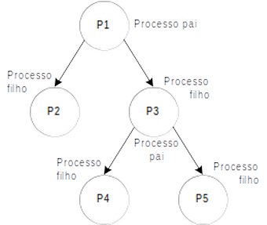

# 13 - Processos

## A chamada `fork`

A chamada `fork` cria um clone do processo atual e retorna duas vezes: uma vez no processo original (pai) e uma vez no processo novo (filho). Cada processo segue executando o programa linha a linha, porém cada um possui áreas de memória separadas. Ou seja, mudar uma variável no processo pai não muda seu valor no filho (e vice-versa). Todo processo é identificado por um número chamado de `pid`.

!!! tip 
    O `pid` é incrementado conforme novos processos vão sendo iniciados.

Considerando o código abaixo (arquivo *exemplo1-fork.c*), responda.

```c
pid_t pai, filho;
int variavel = 5;

filho = fork();
if (filho == 0) {
    // processo filho aqui
    pai = getppid();
    filho = getpid();
    variavel *= 2;
    printf("eu sou o processo filho %d, meu pai é %d\nvariavel %d\n",
        filho, pai, variavel);
} else {
    // processo pai aqui!
    pai = getpid();
    printf("eu sou o processo pai %d, meu filho é %d\nvariavel %d\n",
        pai, filho, variavel);
}
return 0;
```

Responda os primeiros dois exercícios **sem rodar o programa**!

!!! exercise text short
    Qual seria o valor de `variavel` no print do pai? e do filho?

    !!! answer
        No pai `variavel` vale `5`.
        No filho `variavel` vale `10`.

!!! exercise text short
    Esse valor mudaria conforme o pai (ou o filho) executam primeiro?

    !!! answer
        Não, isto mudaria apenas a ordem dos textos na tela. Uma vez realizado o `fork`, passamos a ter dois processos independentes em memória e execução.

!!! example
    Compile e execute o programa acima. As suas respostas estão corretas?

    <div class="termy">

    ```console
    $ gcc -Og -Wall -g exemplo1-fork.c -o exemplo1-fork
    $ ./exemplo1-fork
    ```

    </div>

------------------

!!! example
     Em um arquivo novo `.c` criado do zero, faça um programa que cria 8 processos filhos (numerados de 1 a 8) e faz cada um imprimir na tela seu seu identificador. O processo pai deve imprimir 0, enquanto o primeiro filho imprime 1, o segundo 2 e assim em diante. A saída de seu programa deverá seguir o modelo abaixo:

    ~~~
    Eu sou o processo pai, pid=%d, meu id do programa é %d\n
    Eu sou um processo filho, pid=%d, ppid=%d, meu id do programa é %d\n
    ~~~

    A primeira linha só deve ser mostrada uma vez pelo processo pai. Para verificar que seu programa funciona corretamente não se esqueça de contar quantos `printf` foram feitos. Se houver mais que 9 houve algum problema na sua solução.


!!! exercise text long

    O programa abaixo termina? Explique sua resposta.

    ```c
    int rodando = 1;
    pid_t filho;

    filho = fork();

    if (filho == 0) {
        printf("Acabei filho\n");
        rodando = 0;
    } else {
        while (rodando) {
            printf("Esperando o filho acabar!\n");
            sleep(1);
        }
    }
    return 0;
    ```

    !!! answer
        Não.
        Uma vez realizado o `fork`, passamos a ter dois processo independentes em memória e execução.
        Como o código `rodando = 0` é executado apenas no processo filho, esta ação não tem efeito no processo pai, que é onde será executado o `while`.
        Se ficou com dúvidas por que o bloco verdadeiro do `if` é executado apenas no filho e o bloco falso apenas no pai, peça ajuda ao professor!

<!-- !!! progress
    Próxima seção -->

## As chamadas `wait/waitpid`

Um processo pode esperar seus filhos acabarem usando uma das chamadas `wait` ou `waitpid`. Esta chamada retorna um código numérico que representa a saída do programa (o que foi retornado pelo `main`) e um conjunto de flags que indica se houve término anormal. O código **errado** do último exercício tentava simular estas chamadas usando uma variável `rodando` e checando seu valor. A maneira correta de esperar um processo filho terminar é usando `wait` ou `waitpid`.

!!! exercise text medium
    Pesquise como usar `wait` no manual. Escreva abaixo a assinatura da função. Qual é o valor retornado? O que é retornado na varíavel passada como ponteiro?
    
    !!! answer
        Aqui está a saída do `man wait`. **Execute em seu terminal** para ver a saída completa!
        <div class="termy">

        ```console
        $ man 2 wait
                WAIT(2)                                                                                   Linux Programmer's Manual                                                                                   WAIT(2)

        NAME
            wait, waitpid, waitid - wait for process to change state

        SYNOPSIS
            #include <sys/types.h>
            #include <sys/wait.h>

            pid_t wait(int *wstatus);

            pid_t waitpid(pid_t pid, int *wstatus, int options);

            int waitid(idtype_t idtype, id_t id, siginfo_t *infop, int options);
                            /* This is the glibc and POSIX interface; see
                                NOTES for information on the raw system call. */

        Feature Test Macro Requirements for glibc (see feature_test_macros(7)):
        ```

        </div>

!!! example
    Modifique o programa `exemplo2-errado.c` para usar `wait` para esperar o processo filho terminar. Após o filho terminar o pai deve mostrar uma mensagem na tela indicando este fato. Salve este arquivo como `exemplo2-certo.c`

!!! exercise text short
    É possível obter o valor retornado pelo `main` de um processo usando `wait`. Pesquise no manual como fazê-lo.

    **Dica**: procure por *exit status*.

    !!! answer
        Confira com o professor!

!!! example
    Modifique o `exemplo2-certo.c` para que o filho retorne `2` e modifique o pai para que ele obtenha esta informação a partir dos valores retornados pelo `wait`. Você precisará ler o manual de `wait` para fazer este exercício.

## Exercícios Extras

Estes exercícios não são para entrega. Utilize esta lista para praticar os assuntos aprendidos na aula.

!!! exercise
    Faça um programa que lê um número inteiro. Em dois processos filhos, deve ser calculado e impresso o dobro e a metade desse número.

!!! exercise
    Faça um programa em que o processo pai lê dois valores inteiros (`n1` e `n2`). Em seguida, são criados 4 processos filhos. Com os valores lidos pelo pai, os filhos devem calcular e imprimir em paralelo as seguintes operações.
    ```
    n1 – n2 
    n1 + n2 
    n1 / n2 
    n1 * n2 
    ```

!!! exercise
    Faça um programa que crie um grupo de processos conforme a hierarquia apresentado abaixo, cada filho deve imprimir o seu PID e o PID do processo que o criou.

    

!!! exercise
    Faça um programa que lê um número inteiro indicando o número de filhos que o pai terá que criar. Ou seja, todos os processos filhos são do mesmo pai. Crie o número de processos solicitado.
    
    Cada filho deve:

    - Esperar por 5 segundos assim que for criado
    - Imprimir:
        - O seu número de ordem de criação
        - O seu PID
        - O PID do processo pai. 
    - Sair retornando `0`.


!!! warning "Super importante!"
    Caso ainda não tenha feito, reescreva os exercícios anteriores para que o pai só seja finalizado quando todos os seus filhos já tenham terminado sua execução.

!!! exercise
    Dado um vetor `A` de `n` elementos e uma variável `c`, faça um programa paralelo para determinar a quantidade de elementos de `A` que são menores que `c`.

    Cada filho deve imprimir a quantidade de elementos de `A` que são menores que `c`.

    **Obs**:
    
    - Você pode escolher o tipo do vetor (int, char, long, short)
    - Leia o `n`, aloque o vetor dinamicamente e então leia todos os elementos do vetor
    - Suponha que `n` é múltiplo do número de filhos criados pelo processo pai
    - Você pode escolher o número de filhos criados pelo pai.