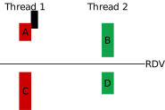

# 21 - Semáforos II e Modelos de concorrência

Na aula anterior, trabalhamos com semáforos de um ponto de vista principalmente conceitual.

Aproveitaremos a aula de hoje para fixar nosso conhecimento sobre semáforos, verificando como implementar semáforos POSIX. Além disso, iremos explorar o modelo produtor consumidor.

## Correção Rendez-vous POSIX

Implemente (do zero) um programa que cria duas threads e as sincroniza usando *RDV*. Ambas deverão fazer um `print` antes e um depois do ponto de encontro. Use o seguinte esquema como guia.

As partes A e B podem ser feitas em qualquer ordem, mas ambas obrigatoriamente devem ocorrer antes de iniciar a execução de C e D. Note que C e D também podem ser feitas em qualquer ordem.

## Aplicação de Semáforos

Já vimos o uso de semáforos para sincronizar threads, de forma que as threads esperem pelas outras em um ponto de encontro. Agora, vamos utilizar semáforos para controlar a quantidade de threads que podem acessar ao mesmo tempo um recurso computacional.

!!! example
    Implemente (do zero) um programa que cria `N` threads, entretanto, apenas `MAX` threads podem executar ao mesmo tempo.

!!! tip
    Tente pensar no que acontece com `sem_wait` e `sem_post` quando o semáforo é inicializado com valor maior que zero.

## Modelos de concorrência

Vamos implementar o modelo produtor consumidor, levando em consideração que:

1. As threads produtoras e consumidoras compartilham um cache único. Pode ser um array de inteiros.
2. Ambas as threads rodam em loop infinito simulando um stream de dados. A cada iteração, as threads sorteiam um valor aleatório de segundos (por ex, entre `0` e `5`) e então tentam pruduzir / consumir os dados.

!!! example
    Implemente (do zero) um programa que cria uma thread produtora e uma thread consumidora.

!!! question short
    Como os índices do cache serão manipulados pelas threads produtora e consumidora?! Qual tipo de dados é indicado?

    !!! details
        Procure por fila circular, buffer circular!

!!! example
    Implemente uma versão com `M` threads produtoras e `N` threads consumidoras.