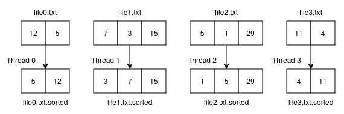
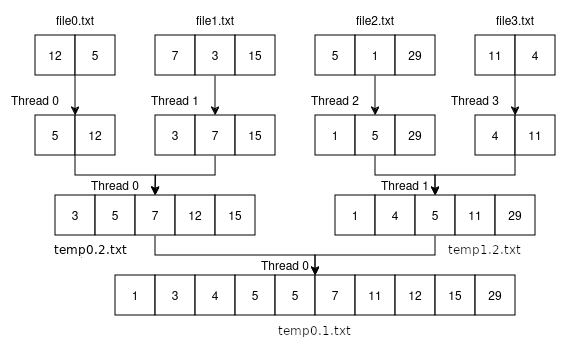
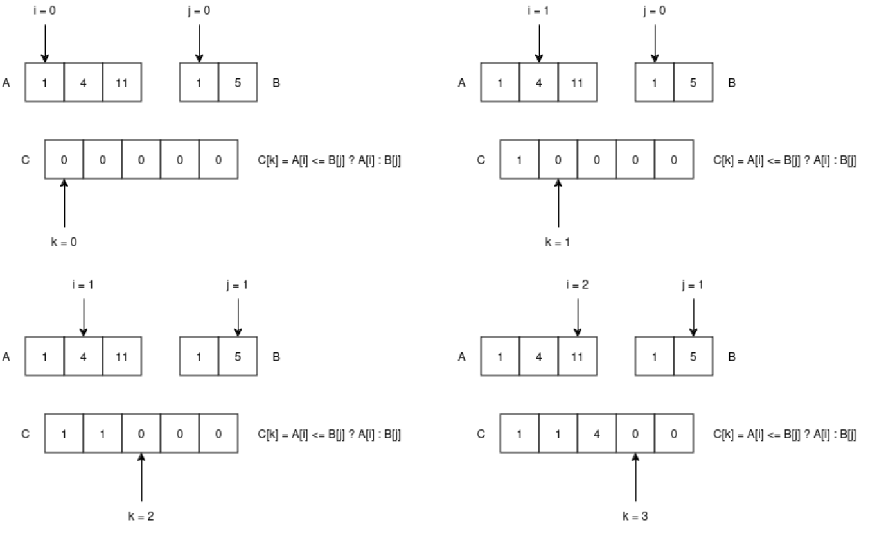
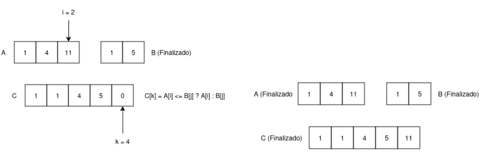

# Lab de Threads

Este laboratório testará suas habiliades com threads, fazendo com que você crie e gerencie um programa que ordena números armazenados em arquivos. Você deverá implementar um programa (**`ordena_combina.c`**) que organize uma série de arquivos de maneira paralelizada utilizando-se das threads que biblioteca POSIX da linguagem C te disponibiliza.

## Ideia principal
A ideia principal a ser seguida é a de particionamento do trabalho de ordenação e combinação dos arquivos. Os arquivos possuirão uma série de números inteiros separados por quebras de linhas, inclusive na última linha. Assim cada linha no arquivo terá somente um inteiro, por exemplo:

```
4
1
10
9
...
```
Cada arquivo possuirá uma quantidade aleatória de números, dessa forma, o seu trabalho inicial será alocar para cada arquivo lido, uma thread **"worker"** que terá a função de organizar os items presentes no arquivo, e gerar como saída um **arquivo intermediário** contendo os itens em ordem crescente (ordenados). Siga o exemplo:



*Exemplo 01: Organização paralelizada inicial dos arquivos*

Cada thread **"worker"** deve carregar todos os itens do seu arquivo em memória, em um array por exemplo, e utilizar a função `qsort()` da biblioteca `stdlib` para fazer a ordenação dos números. Essa função opera utilizando um algoritmo de complexidade `O(n log(n))`. Em caso de dúvida, utilize o manual para encontrar a assinatura da função e uma explicação de como utiliza-la.

Os **arquivos intermediários** devem seguir o padrão de nome `X.txt.sorted` onde `X` é o nome original do arquivo.

Após a ordenação inicial dos elementos dos arquivos entrada, você passará para uma etapa de combinação onde, cada thread **"worker"** terá como entrada dois arquivos intermediários (ordenados) que deverão ser combinados em um único arquivo temporário ordenado. Este fase deve ser feita por uma thread **"worker"** para cada combinação.

Essa etapa de combinação deverá ser repetida até que reste um único arquivo com todos os números ordenados. Cada combinação entre dois arquivos é salva em um arquivo temporário que deve seguir o padrão de nome `tempN.T.txt`: onde `N` é o número do arquivo temporário (começando em `0`) e `T` é a quantidade de threads **"worker"** naquela fase de combinação.

Assim, seguindo a regra para nomes de arquivos temporários, a última combinação (combinação final) terá o arquivo `temp0.1.txt` como saída.

Siga o exemplo na imagem abaixo para ter uma ideia melhor dos processos de organização e combinação:




*Exemplo 02: Organização e combinação paralelizadas*

## Complexidade da etapa de combinação

Como visto antes, a função `qsort()` trabalha utilizando um algoritmo de complexidade `O(n log(n))`, assim, no pior caso, a etapa de organização trabalhará na mesma complexidade.

Contudo, a etapa de combinação tem a possibilidade de trabalhar em uma complexidade melhor que `O(n log(n))`, no caso, `O(n)`.

A maneira trivial de combinar dois arquivos previamente ordenados é, carregar todos os itens dos dois arquivos em arrays separados, concatenar os dois arrays e utilizando a mesma função de organização (`qsort()`) usada anteriormente para organizar os arrays. 

**Você acha que essa solução é boa? Ela pode ser melhorada?**

A maneira "menos trivial", apesar de simples, que melhora consideravelmente o desempenho da sua solução, é aproveitar que arquivos já estão ordenados, e carregar todos os itens dos dois arquivos em arrays separados, percorrer ambos arrays, ao mesmo tempo, e formar um novo array que posteriormente será armazenado em um arquivo temporário. Veja as imagens abaixo para ter uma boa ideia do algoritmo:





*Exemplo 03: Organização do array utilizando complexidade `O(n)`*

## Compilação e testes de memória

A compilação deve ser sempre feita utilizando o comando abaixo:

```
gcc -Wall -pedantic ordena_combina.c -o ordena_combina -lpthread
```

Para checar problemas de memória, utilize o comando abaixo:

```
valgrind --leak-check=yes ./ordena_combina file0.txt file1.txt 
```

Lembrando que, utilizaremos os mesmos comandos apresentados acima para compilação e os testes de memória, portanto, use-os para evitar problemas. 

**Importante**: Considere que sempre testaremos o seu programa passando pelo **menos 2 arquivos** na entrada.


## Restrições

Esta atividade serve como avaliação dos conceitos vistos na disciplina. Portanto, algumas restrições serão aplicadas ao código de vocês:

- todo trabalho com arquivos deverá ser feito usando as APIs POSIX vistas em aula. **Não é permitido o uso de funções da** `Standard I/O` para manipulação de arquivos, como por exemplo `fopen()`, `fread()` e `fclose()`. 
- se você usar algum trecho de código da documentação (ou de outra fonte), coloque uma atribuição em um comentário no código.
- **Fica proibido** o uso de ferramentas de **geração de código automático por IA**, como por exemplo o **ChatGPT**.

 
## Avaliação

A avaliação, além de se basear nas rubricas descritas abaixo, precisará que você escreva um `README.md` em seu repositório contendo a fase e a nota que alcançou. Além disso, é necessário enviar um vídeo de seu programa rodando e com comentários explicativos seus. O link do vídeo deve estar disponível no `README.md`.

A avaliação funcionará de modo cumulativo e manual, sendo assim, uma fase só será aceita como completa caso **TODOS** os requisitos da fase anterior forem completos sem problemas.

## Entrega

Você deverá colocar o programa fonte `ordena_combina.c` na pasta `lab/03-lab-threads` em seu repositório de atividades (github), na branch principal, e fazer **upload (push) do arquivo fonte no seu repositório**,  não precisa soltar tag.

Lembre-se de se atentar ao prazo de entrega definido [aqui!](../sobre.md).


**Fase 0**

* Não entregou;
* Programa não compila;
* Não preencheu o README com a nota que alcançou;
* Não entregou o vídeo explicativo;

**NOTA desta fase**: 0.0

**Fase 1**

* Programa compila com warnings;
* Código fonte escrito de maneira limpa e concisa, evitando trechos de codigo inúteis e não performáticos.
* Programa roda na linha de comando como mostrado abaixo:

    ```
    ./ordena_combina file0.txt file1.txt file2.txt ...
    ```

* Programa abre e organiza os arquivos recebidos pela linha de comando utilizando threads, salvando os resultados em **arquivos intermediários**, com seguinte nome `X.txt.sorted` onde `X` é o nome original do arquivo.;

**NOTA desta fase**: 2.0

**Fase 2**

* Programa compila sem warnings;
* Programa combina os arquivos intermediários ordenados em arquivos temporários utilizando threads, **com cada thread responsável em combinar dois arquivos**. Ao final, quando tivermos somente uma thread, o resultado da última combinação, deverá estar armazendo em um **arquivo final** com o seguinte nome `temp0.1.txt`;
- Considere que nessa fase que que número de arquivos informado por linha de comando será sempre potência de `2` ( 2, 4, 8, 16,...).

**NOTA desta fase**: 5.0

**Fase 3**

* Programa passa pela análise do Valgrind **sem erros**;
* Programa funciona para qualquer quantidade de arquivos de entrada informado por linha de comando, sem a necessidade da quantidade ser potência de `2`, mas como informado acima, sempre passaremos pelo menos 2 arquivos na entrada;

**NOTA desta fase**: 8.0

**Fase 4**

* Programa executa a etapa de combinação em **O(n)**;

**NOTA desta fase**: 10.0

**IMPORTANTE:** Considere as **fases como cumulativas**, ou seja, cada versão deve **manter as funcionalidades da fase anterior** e acrescentar novas, mesmo porque,  para realizar a próxima fase, a fase anterior deve estar pronta. 

Caso você não implemente alguma funcionalidade de uma determinada fase a nota atribuída será a da fase anterior.


### Prazo:

[Clique aqui!](../sobre.md).