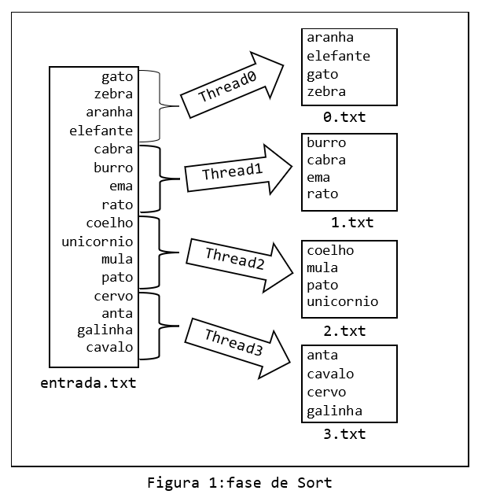
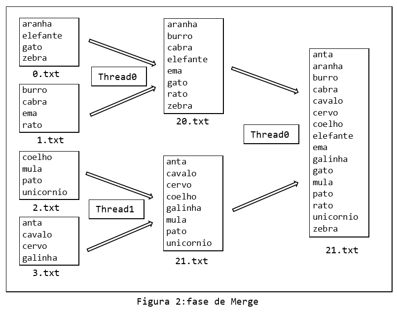

# Lab de Threads 

## Introdução

No Laboratório de Threads, iremos implementar um algoritmo de ordenação de grandes volumes de dados utilizando **Threads**  para ganhar  desempenho. O algoritmo, chamado **Sort-Merge** (ordenação-junção), é utilizado para ordenar dados em situações nas quais não é possível carregar todos os dados na memória do computador. No caso dos algoritmos de ordenação tradicionais, como InsertionSort ou BubbleSort, os dados são carregados na memória da máquina e ordenados.

O algoritmo Sort-Merge possui duas fases distintas, com cada fase consistindo em vários passos. Na primeira fase, chamada **fase de Sort** (ordenação), os dados são divididos em partes que caibam na memória disponível, e são então ordenados e armazenados em arquivos temporários. Essa fase resulta na criação de um conjunto de arquivos temporários, cada um contendo partes (regiões) do arquivo original ordenados. A Figura 1 abaixo ilustra a **fase de Sort**.



Na segunda fase, denominada **fase de Merge** (junção), pares de arquivos temporários criados na fase anterior são lidos dos arquivos temporários e ordenados, intercalando em ordem crescente os elementos lidos, de modo a resultar em um novo conjunto de arquivos temporários ordenados. Os itens de dois arquivos da etapa anterior são intercalados até que se obtenha um arquivo com todos os dados ordenados. A Figura 2 abaixo ilustra a **fase de Merge**




## O que precisa ser feito

Sua tarefa é completar a implementação do  **algoritmo Sort-Merge**, estão disponibilizados no sue repositório de entregas na pasta `lab/03-lab-threads` o código binário de dois programas (**`sort.o`** e **`sort-merge.o`**) que auxiliarão no desenvolvimento da sua solução.


O programa **`sort.o`** contem a implementação da criação das threads para **fase de Sort**, veja a seguir.


```
#include ....

void * sort(void *args);

int main(int nArgs, char **argv)
{   
    int nThreads, nItens;
    int fdIn;
    if (nArgs < 4){
        printf("USAGE:\n");
        printf("./sort <qtd threads> <qtd itens> <arquivo com itens>\n");
        return -1;
    }
    nThreads = atoi(argv[1]);
    nItens   = atoi(argv[2]);
    fdIn=open(argv[3],O_RDONLY) ;
    if( fdIn < 0 )
    {
        fprintf(stderr,"./sort: Erro falha na abertura do arquivo %s \n", argv[3]);
        exit(EXIT_FAILURE);
    }
    printf("Serao criadas %d threads.\n",nThreads);
    pthread_t *tids = malloc(nThreads * sizeof(pthread_t));
    
    struct sort_args *vet_sort = malloc(nThreads * sizeof(struct sort_args));
    pthread_mutex_t mutex_file = PTHREAD_MUTEX_INITIALIZER;

    for (int i = 0; i < nThreads; i++) {
        vet_sort[i].idxThread = i;
        vet_sort[i].nThreads = nThreads;
        vet_sort[i].lineFiles = nItens;
        vet_sort[i].mutex_file = &mutex_file;
        vet_sort[i].fdIn = fdIn;
        pthread_create(&tids[i], NULL, sort, &vet_sort[i]);
        printf("Criou thread:%d fase sort\n", i);
    }
    
    printf("Funcao main() espera as threads sort finalizarem...\n");
    for (int i = 0; i < nThreads; i++) {
        pthread_join(tids[i], NULL);
        close(vet_sort[i].fdOut);   
    }
    close(fdIn);
    free(vet_sort);
    free(tids);
    printf("Funcao main() FASE Sort finalizando normalmente...\n");
    return 0;
}
```

Você deve implementar a função **`void * sort(void * args)`** que representa a thread responsável em ler concorrentemente o arquivo de entrada no arquivo **`solucao.c`**, esse arquivo conterá as soluções das **fase de Sort** e **fase de Sort-Merge**. Para compilar a sua solução use o comando:

```
$ gcc -g -Og -Wall sort.o solucao.c -o sort -pthread
```


Para executar o programa e testar sua solução, informe por linha de comando o número de threads (**`nThreads`**) que o programa deverá criar e o quantidade de itens (**`nItens`**) no arquivo que será ordenado e o nome do arquivo, por exemplo:

    
```
./sort nThreads nItens arqIn

./sort 4 16 in16.txt
```

Considere que o número de Threads **`nThreads`** sempre será maior igual a 2 e é uma potência de 2, mas nem sempre a divisão do  número de itens no arquivo **`nItens`** por **`nThreads`** terá resto 0. Por exemplo se **`nThreads=4`** e **`nItens=19`** 
As 3 primeiras Threads trabalharam com 4 itens e a última com 7 itens na **fase de Sort**


O programa **`sort-merge.o`** contem a implementação completa da criação das threads para **fase de Sort** e para **fase de Merge**, e após resolver a fase anterior você pode compilar esse programa junto com a sua solução no arquivo **`solucao.c`**. 

```
#include ..

void * sort(void *args);
void * merge(void *args);

int main(int nArgs, char **argv)
{   
    int nThreads, nItens;
    int fdIn;
    int *vet_fdOut;

    if (nArgs < 4){
        printf("USAGE:\n");
        printf("./sort-merge  <qtd threads> <qtd itens> <arquivo com itens>\n");
        return -1;
    }
   
    nThreads = atoi(argv[1]);
    nItens   = atoi(argv[2]);
    fdIn=open(argv[3],O_RDONLY) ;
    if( fdIn < 0 )
    {
        fprintf(stderr,"./sort-merge: Erro falha na abertura do arquivo %s \n", argv[3]);
        exit(EXIT_FAILURE);
    }
    printf("Serao criadas %d threads.\n",nThreads);
    pthread_t *tids = malloc(nThreads * sizeof(pthread_t));
    
    struct sort_args *vet_sort = malloc(nThreads * sizeof(struct sort_args));
    pthread_mutex_t mutex_file = PTHREAD_MUTEX_INITIALIZER;

    for (int i = 0; i < nThreads; i++) {
        vet_sort[i].idxThread = i;
        vet_sort[i].nThreads = nThreads;
        vet_sort[i].lineFiles = nItens;
        vet_sort[i].mutex_file = &mutex_file;
        vet_sort[i].fdIn = fdIn;
        pthread_create(&tids[i], NULL, sort, &vet_sort[i]);
        printf("Criou thread:%d fase sort\n", i);
    }
    
    printf("Funcao main() espera as threads sort finalizarem...\n");
    vet_fdOut = malloc(nThreads*sizeof(int));
    for (int i = 0; i < nThreads; i++) {
        pthread_join(tids[i], NULL);
        vet_fdOut[i]=vet_sort[i].fdOut;   
    }
    close(fdIn);
    free(vet_sort);
    free(tids);
    while( nThreads > 1){

        nThreads = nThreads/2;
        tids = malloc(nThreads * sizeof(pthread_t));
        struct merge_args *vet_merge = malloc(nThreads * sizeof(struct merge_args));

        nThreads=%d\n",qtdItensRegiao,nItens,nThreads);
        for (int i = 0; i < nThreads; i++) {
            vet_merge[i].idxThread = i;
            vet_merge[i].nThreads = nThreads;
            vet_merge[i].fdIn1 = vet_fdOut[i*2];
            vet_merge[i].fdIn2 = vet_fdOut[(i*2)+1];
            pthread_create(&tids[i], NULL, merge, &vet_merge[i]);
            printf("Criou thread:%d fase merge nThread:%d \n", i,nThreads);
        }

        for (int i = 0; i < nThreads; i++) {
            pthread_join(tids[i], NULL);
            vet_fdOut[i]=vet_merge[i].fdOut;
        }
            
        free(tids);
        free(vet_merge);
    }  
    close(vet_fdOut[0]);
    free(vet_fdOut);   
    printf("Funcao main() FASE Sort-Merge finalizando normalmente...\n");
    return 0;
}
```
Para compilar a sua solução (`solucao.c`) com o programa **`sort-merge.o`**  use o comando:

```
$ gcc -g -Og -Wall sort-merge.o solucao.c -o sort-merge -pthread
```

## Como começar?

Faça `git pull` no seu repositório entregas e verifique na pasta lab se você recebeu os seguintes arquivos: 

- **`sort.o`** contem o código binário que cria as threads na **`fase de Sort`**. 

- **`sort-merge.o`** contem o código binário que cria as threads na **`fase de Sort`** e **`fase de Merge`**. 

- **`sort-merge.h`** arquivo com a declaração das estrutas e as funções usadas nas duas fases.

- **`in16.txt`** e outros arquivos de testes para você começar a implementar as suas soluções.

- **`solucao.c`** programa fonte que deverá ser entrega com a sua implementação das threads nas fases  **`Sort`** e  **`Merge`**. 

## Avaliação

O programa será avaliado usando uma rubrica que descreve as duas fases implementadas. 

**Atenção:** Os testes automáticos serão nossa forma principal de avaliação. Entretanto, o professor poderá utilizar processos extras de avaliação, como: entrevistas, revisão manual de código.


**IMPORTANTE**: Os arquivos fontes disponilizados são para vocês entenderem como são realizadas as chamadas das threads, não gere novamente os arquivos **`sort.o`** e **`sort-merge.o`**.


### Tag `lab3.0.x`: fase Sort

Na fase de **Sort** cada thread deverá alocar um espaçao na memória para armazenar os itens de sua região, para tanto considere as seguintes observações:

* No arquivo de entrada cada item no arquivo de entrada será uma sequência de caracteres (por exemplo um nome de um animal), considere que os itens terão no **máximo 20 caracteres** (somente letras em minúsculo) e cada um deles  estará armazenado em uma linha do arquivo finalizada por `\n`, a exceção é a última linha que não tem `\n`, além disso considere que podemos ter itens repetidos no arquivo.

* O arquivo de entrada será um recurso compartilhado que precisará tem seu acesso controlado, a thread principal informa para as threads criadas o descritor do arquivo de entrada e cada thread filha deve acessar o arquivo em modo exclusivo. Um detalhe importante que você deve resolver é como fazer com que as threads fihas façam a leitura correta de sua região no arquivo de entrada.

* Serão criadas nThreads (Thread 0, 1, ... n), informado por linha de linha de comando, e cada thread deve ler sua região no arquivo de entrada corretamente, ou seja, conforme exemplo da figura 1.

* Nessa fase você cada thread pode utilizar algoritmos tradicionais de ordenação (InsertionSort ou BubbleSort), para ordem ordenar sua porção do arquivo em memória.


* Ao final da ordenação a thread deve escrever o seu resultado em um arquivo, a `Thread 0` cria e escreve no arquivo `0.txt`, a `Thread 1` cria e escreve no arquivo `1.txt` e assim por dianto. E por fim retorna para função principal (**`main()`**) o ponteiro (`FILE *`) do arquivo que foi criado para armazenar os seus itens ordenados. O arquivo ordenado tem o mesmo formato do arquivo de entrada, ou seja, cada linha separada por `\n` com exceção a última linha que não tem `\n`.

* Para entregar **fase de Sort** a **envie para o github suas alterações** e suba uma tag com o padrão de nomenclatura `lab3.0.x`, substituindo `x` por qualquer número inteiro! Ex:

```
$ git tag -a lab3.0.0 -m "lab3.0.0"
$ git push origin lab3.0.0
```


**NOTA desta fase**: 6.0

### Tag `lab3.1.x`: fase Sort-Merge

para realizar essa fase você deverá ter finalizado a fase de **`Sort`**, pois esta fase tem como entrada os arquivos gerados na fase anterior (veja Figura 2). Por conta disso considere as seguintes observações:

* As threads nessa fase terão como entrada os descritores de arquivos gerados na fase anterior. No programa   **`sort-merge.o`** poderá ver que os descritores de arquivos são passados para as threads através de uma estrutura (`struct`).

* Cada thread receberá dois descritores de arquivos da fase anterior e fará o merge (intercalação) dos dois arquivos e gerando um terceiro arquivo que será retornado para a função principal (**`main()`**),  que usará esse arquivo para próxima iteração.

* O **nome** do arquivo criado nessa fase deverá ter o seguinte formato = quantidade de threads que estão executanto simultanamente concatenado com o número da thread (veja a Figura 2). Por exemplo se tiverem  `2` threads executando simultaneamente a `Thread 0` gerará o arquivo `20.txt` e a `Thread 1 ` gerará o arquivo `21.txt`

* Note na função  (**`main()`**) que a cada iteração o número de threads será reduzida pela metada, até que reste somente uma thread e assim é finalizada o merge.

* Para entregar **fase de Merge** a **envie para o github suas alterações** e suba uma tag com o padrão de nomenclatura `lab3.1.x`, substituindo `x` por qualquer número inteiro! Ex:

```
$ git tag -a lab3.1.0 -m "lab3.1.0"
$ git push origin lab3.1.0
```

**NOTA desta versão**: 10.0


### Prazo 
[Clique Aqui](../../sobre)

